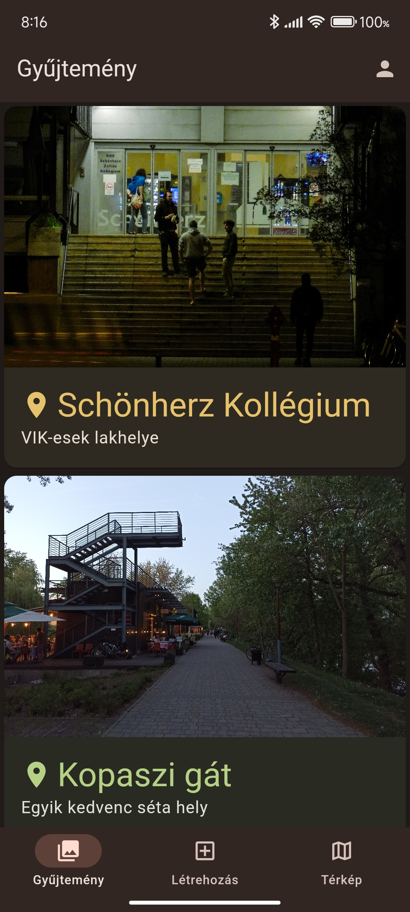
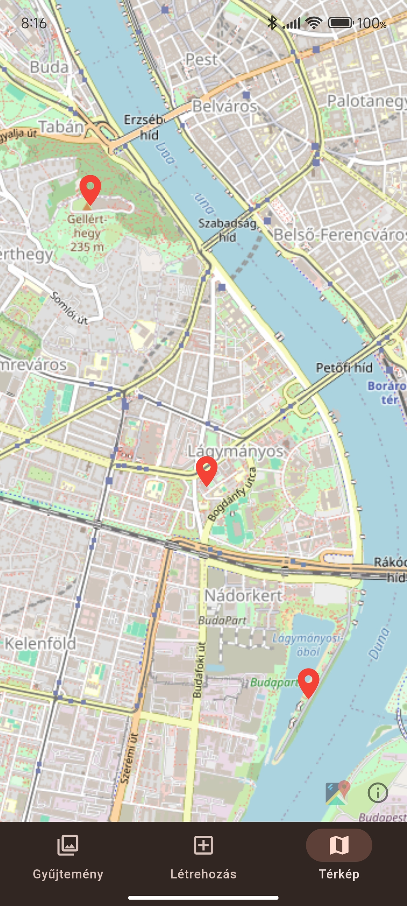

# Find a Spot
> This repository contains my homework for the university course *BMEVIAUAV45 - Flutter-based Software Development*

## Description
The idea for this app came from the internet meme *"Bro said he knew a spot"*. You can upload images with a description and mark its location, to collect cool spots. These spots than can be viewed in a list or on a map.

## Screenshots
<div style="display: flex; flex-wrap: wrap;">
	
	
</div>

## Development
1. Configure the Firebase emulator
   1. Initialize the Firebase
		```
		firebase init
		```
	2. Select `Emulators: Set up local emulators for Firebase products`
	3. Select emulators
		- `Authentication Emulator`
  		- `Firestore Emulator`
  		- `Storage Emulator`
2. If you only want to use the emulators without setting up a Firebase project, you need to comment out the line `id 'com.google.gms.google-services'` in your `android/app/build.gradle`
3. Create a `.env` file in the root of the project and set the `FIREBASE_EMULATOR_HOST=127.0.0.1` variable. You can change the host if you want to access the emulator on a local network for example.
4. Get the dependencies 
	```sh
	flutter pub get
	```
5. Build the generated files
	```sh
	dart run build_runner build
	```
6. Run in debug mode
	```sh
	flutter run
	```